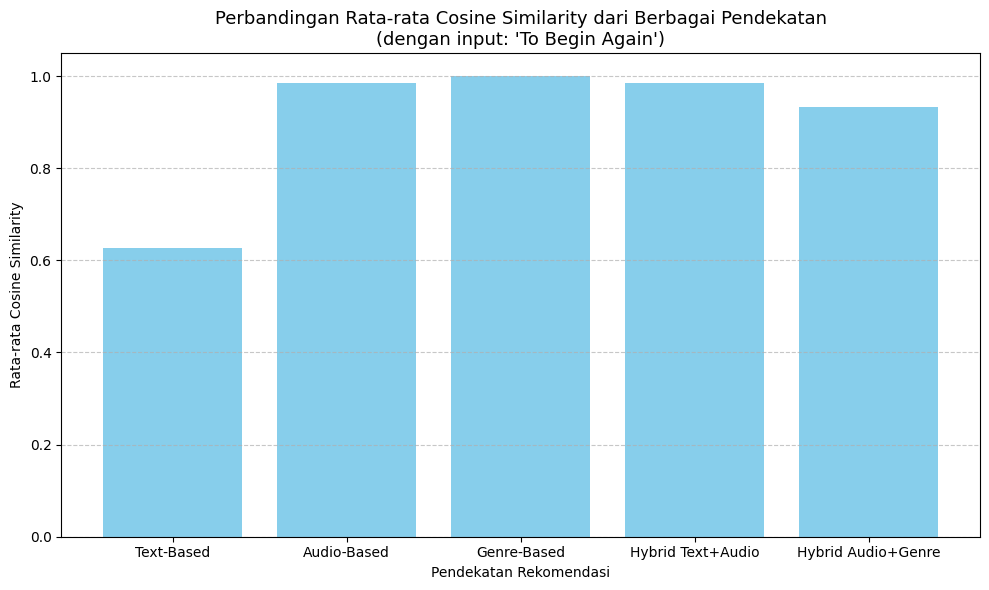

# Laporan Proyek Machine Learning - Ahmad Kholish Fauzan Shobiry

---

### Latar Belakang
Proyek ini bertujuan untuk mengembangkan sistem rekomendasi lagu berbasis konten (Content-Based Filtering) menggunakan fitur deskriptif dari lagu seperti nama lagu, artis, album, dan genre. Sistem ini akan membantu pengguna menemukan lagu yang mirip dengan preferensi mereka berdasarkan kesamaan fitur musik.

### Tujuan Proyek
Proyek ini bertujuan untuk membangun sistem rekomendasi musik berbasis content-based filtering dengan tujuan:
1. Membantu pengguna menemukan lagu-lagu baru yang mirip dengan lagu favorit mereka.
2. Memberikan pengalaman mendengarkan musik yang lebih personal dan relevan.
3. Memanfaatkan fitur audio dari lagu seperti danceability, valence, dan tempo untuk menghasilkan rekomendasi yang sesuai dengan preferensi pengguna.

### Ruang Lingkup
Proyek difokuskan pada sistem rekomendasi lagu berbasis content-based filtering dengan pendekatan sebagai berikut:
1. Dataset yang digunakan adalah Spotify Tracks Dataset dari Kaggle.
2. Sistem akan menggunakan fitur-fitur numerik seperti danceability, energy, acousticness, valence, dan tempo untuk menghitung kemiripan antar lagu.
3. Rekomendasi dihasilkan dengan menghitung similarity menggunakan ANN antar lagu berdasarkan fitur audio.

### Referensi
- [Dataset: Spotify Tracks Dataset – Kaggle](https://www.kaggle.com/datasets/maharshipandya/-spotify-tracks-dataset)
---

## Business Understanding
### Problem Statements
1. Bagaimana cara merekomendasikan lagu yang serupa dengan lagu favorit pengguna berdasarkan fitur-fitur kontennya?
2. Bagaimana membantu pengguna menemukan lagu baru yang sesuai dengan selera musik mereka tanpa harus mencari secara manual?

### Goals
1. Mengembangkan sistem rekomendasi lagu berbasis konten yang dapat menyarankan lagu-lagu serupa dari fitur yang tersedia seperti nama lagu, artis, genre, dan album.
2. Meningkatkan pengalaman pengguna dalam menemukan musik baru dengan pendekatan personal dan otomatis.

### Solution Statements
1. Pendekatan: Content-Based Filtering dengan menggunakan fitur-fitur deskriptif (track_name, artists, album_name, track_genre) yang diubah menjadi representasi vektor menggunakan TF-IDF, lalu dihitung kesamaannya menggunakan ANN.
2. Fitur tambahan: Potensi penggunaan fitur audio seperti danceability, energy, valence, atau tempo untuk meningkatkan kualitas rekomendasi (di tahap pengembangan lanjutan).
3. Mengukur hasil rekomendasi menggunakan Cosine Similarity untuk mengetahui keakuratan hasil rekomendasi.

Cosine similarity mengukur kesamaan antara dua vektor dan menentukan apakah kedua vektor tersebut menunjuk ke arah yang sama. Ia menghitung sudut cosinus antara dua vektor. Semakin kecil sudut cosinus, semakin besar nilai cosine similarity. Metrik ini juga sering digunakan untuk mengukur kesamaan dokumen dalam analisis teks, sehingga cocok digunakan pada project dalam menilai kedekatan/keakuratan prediksi untuk pendekatan sistem rekomendasi.

---

## Data Understanding
Dataset yang digunakan adalah Spotify Tracks Dataset yang berisi 114.000 lagu dari 125 genre berbeda. Setiap lagu memiliki informasi deskriptif serta fitur audio yang diperoleh dari Spotify API.

### Format File
Dataset disimpan dalam format .csv dan telah dimuat ke Google Colab melalui path: /kaggle/input/-spotify-tracks-dataset/dataset.csv.

### Statistik Dataset
1. Jumlah lagu: 114.000
2. Jumlah genre: 114
3. Jumlah artis unik: ribuan
4. Distribusi genre cukup seimbang: sebagian besar genre memiliki 1.000 lagu

### Variabel dalam Dataset
Berikut merupakan variabel-variabel dalam dataset, antara lain:
1. track_id: ID unik lagu dari Spotify.
2. artists: Nama penyanyi atau grup musik; jika lebih dari satu, dipisahkan dengan tanda titik koma (;).
3. album_name: Nama album tempat lagu tersebut dimuat.
4. track_name: Judul lagunya
5. popularity: Tingkat popularitas lagu (skala 0–100); makin tinggi berarti makin sering didengarkan saat ini.
6. duration_ms: Durasi lagu dalam milidetik
7. explicit: Apakah lagu mengandung lirik eksplisit (true = ya, false = tidak/kurang jelas).
8. danceability: Seberapa cocok lagu untuk menari (0.0 = tidak cocok, 1.0 = sangat cocok).
9. energy: Ukuran intensitas dan aktivitas lagu (0.0 = tenang, 1.0 = sangat energik).
10. key: Nada dasar lagu (0 = C, 1 = C♯/D♭, dst; -1 jika tidak terdeteksi).
11. loudness: Tingkat keras suara lagu dalam desibel (dB)
12. mode: Skala lagu; 1 = mayor (ceria), 0 = minor (sedih).
13. speechiness: Seberapa banyak unsur bicara dalam lagu (0.0 = musik murni, 1.0 = penuh bicara)
14. acousticness: Keyakinan bahwa lagu bersifat akustik (0.0 = tidak akustik, 1.0 = sangat akustik).
15. instrumentalness: Perkiraan bahwa lagu tidak memiliki vokal (0.0 = banyak vokal, 1.0 = full instrumental).
16. liveness: Kemungkinan lagu direkam secara langsung di hadapan penonton (nilai > 0.8 = kemungkinan besar live).
17. valence: Tingkat nuansa emosional positif dalam lagu (0.0 = sedih, 1.0 = bahagia).
18. tempo: Kecepatan lagu dalam beat per menit (BPM).
19. time_signature: Tanda birama lagu (jumlah ketukan per bar; biasanya antara 3 sampai 7).
20. track_genre: Genre atau jenis musik lagu tersebut.

---

## Data Preparation
Pada tahap ini, dilakukan sejumlah proses pembersihan dan transformasi data untuk memastikan bahwa dataset siap digunakan dalam pengembangan sistem rekomendasi musik. Beberapa langkah utama yang dilakukan meliputi:

1. Mengatasi Missing Values dan Cek Duplikasi
  - Beberapa kolom dalam dataset dapat mengandung nilai kosong (NaN) dan kesamaan data (Duplikasi) yang perlu ditangani agar tidak mengganggu proses pembentukan fitur dan pemodelan sistem rekomendasi. Strategi yang digunakan antara lain:
  - Menghapus baris dengan nilai kosong pada kolom penting seperti track_name, artists, dan fitur audio (danceability, energy, dll).
  - Dataset memiliki 114.000 baris dan 21 kolom, dengan kolom penting seperti track_name, artists, album_name, dan track_genre hampir seluruhnya lengkap (hanya 1 missing value per kolom teks). Terdapat 114 genre unik dengan jumlah lagu per genre relatif seimbang (seribu lagu per genre). Selanjutnya, diketahui bahwa kolom teks seperti track_name, artists, dan album_name memiliki 1 missing value. Karena ini merupakan sistem rekomendasi dimana berbasis Content-Based Filtering, maka 3 kolom tersebut sangat penting untuk diketahui isinya, karena terdapat missing value pada 3 kolom tersebut dan jumlahnya sangat sedikit, maka bisa dihapus saja karena tidak akan memperngaruhi pengolahan data keseluruhan.

2. Memastikan Tipe Data
  - Beberapa kolom perlu dikonversi ke tipe data yang sesuai agar proses analisis dan komputasi berjalan dengan optimal:
    - Kolom duration_ms dikonversi menjadi detik agar lebih mudah dibaca.
    - Kolom explicit dikonversi ke tipe boolean (True/False).
    - Kolom numerik seperti popularity, danceability, energy, valence, dan tempo dikonversi ke tipe float untuk kebutuhan pemodelan.

3. Membuat Fitur Gabungan
  - Untuk mendukung pendekatan content-based filtering, dibuat representasi fitur numerik yang dapat digunakan untuk menghitung kemiripan antar lagu:
  - Digunakan fitur-fitur audio utama yang bersifat numerik seperti:
    1. danceability
    2. energy
    3. valence
    4. acousticness
    5. instrumentalness
    6. tempo
    7. speechiness
    8. liveness
  
4. Kolom track_genre juga dapat digunakan sebagai informasi tambahan untuk segmentasi atau analisis deskriptif.

Fitur-fitur ini akan digunakan dalam proses ekstraksi vektor fitur dan perhitungan similarity antar lagu untuk menghasilkan rekomendasi.

---

## Modelling

Sesuai dengan Solution Statements yang telah ditentukan, sistem rekomendasi musik ini akan dikembangkan melalui beberapa pendekatan, antara lain:

1. **Pendekatan 1: Content-Based Filtering Berbasis Metadata Teks**
  - Sistem merekomendasikan lagu berdasarkan kemiripan konten deskriptif dari lagu yang dipilih oleh pengguna. Informasi yang digunakan meliputi:
    - track_name (judul lagu)
    - artists (nama penyanyi atau band)
    - album_name (nama album)
    - track_genre (genre musik)
  - Seluruh informasi tersebut digabung dalam satu kolom bernama combined_features, kemudian direpresentasikan sebagai vektor teks menggunakan TF-IDF (Term Frequency–Inverse Document Frequency). Kemiripan antar lagu dihitung menggunakan algoritma Approximate Nearest Neighbors (ANN) melalui NearestNeighbors dari Scikit-Learn.
  - Sistem juga melakukan penghitungan keakuratan rekomendasi menggunakan Cosine Similarity

2.  **Pendekatan 2: Content-Based Filtering Berbasis Fitur Audio**
  - Selain metadata, sistem juga memanfaatkan fitur numerik audio dari tiap lagu, antara lain variabel `danceability, energy, valence, tempo, acousticness, instrumentalness, speechiness, dan liveness`.
  - Fitur-fitur ini menggambarkan karakteristik teknis dari lagu dan diolah sebagai berikut:
    - Normalisasi fitur numerik menggunakan MinMaxScaler
    - Perhitungan kemiripan antar lagu menggunakan ANN
    - Penyajian lagu-lagu terdekat berdasarkan kemiripan vektor audio
  - Kelebihan:
    Pendekatan ini mampu menyarankan lagu-lagu dengan mood, energi, atau gaya musik yang mirip, bahkan jika berasal dari genre atau artis yang berbeda.
  - Sistem juga melakukan penghitungan keakuratan rekomendasi menggunakan Cosine Similarity

3. **Pendekatan 3: Rekomendasi Berdasarkan Genre**
  - Sistem juga menyediakan rekomendasi berbasis genre, di mana lagu-lagu dengan genre yang sama dengan lagu input akan disaring, lalu disusun berdasarkan popularitas (popularity) tertinggi.
  - Sistem juga melakukan penghitungan keakuratan rekomendasi menggunakan Cosine Similarity

4. **Pendekatan 4: Hybrid Filtering: Teks + Audio**
  - Sistem ini menggabungkan skor dari dua model ANN:
    - TF-IDF (representasi metadata teks)
    - ANN untuk fitur numerik audio
  - Gabungan skor menggunakan parameter alpha untuk mengatur bobot kontribusi masing-masing model.
  - Contoh: alpha = 0.5 memberi kontribusi seimbang antara teks dan audio.
  - Menghasilkan rekomendasi yang lebih seimbang dari sisi semantik dan musikalitas.
  - Sistem juga melakukan penghitungan keakuratan rekomendasi menggunakan Cosine Similarity

5. **Pendekatan 5: Hybrid Filtering: Audio + Genre**
  - Pendekatan ini menggabungkan:
    - Kemiripan fitur audio (melalui ANN)
    - Filter berdasarkan genre yang sama
  - Setelah menemukan lagu-lagu mirip secara audio, sistem menyaring hanya lagu-lagu dengan genre yang sesuai.
  - Kelebihan: Menghasilkan rekomendasi lagu yang memiliki mood serupa sekaligus mempertahankan genre musik yang disukai.
  - Sistem juga melakukan penghitungan keakuratan rekomendasi menggunakan Cosine Similarity

### Tujuan Modelling
Melalui lima pendekatan ini, sistem rekomendasi ini bertujuan untuk:
1. Menyediakan rekomendasi lagu yang personal dan kontekstual
2. Memberikan fleksibilitas pendekatan sesuai preferensi pengguna
3. Menggabungkan kekuatan teks deskriptif dan fitur akustik dalam satu sistem
4. Membantu pengguna menemukan lagu-lagu baru yang relevan berdasarkan kesamaan gaya, suasana, dan genre.

---

## Evaluation
Dalam proyek ini, saya membangun sistem rekomendasi lagu menggunakan pendekatan Content-Based Filtering dengan lima metode berbeda: berbasis teks, berbasis audio, berbasis genre, serta dua pendekatan hybrid (teks+audio dan audio+genre). Berikut adalah ringkasan hasil dan analisis dari masing-masing pendekatan:

1. Text-Based Filtering
 - Pendekatan ini merekomendasikan lagu-lagu yang sangat mirip dari segi nama lagu, artis, dan genre. Hal ini terbukti dari hasil rekomendasi yang sebagian besar berasal dari artis yang sama (Ingrid Michaelson) dan genre acoustic. Meskipun relevan secara tematik, pendekatan ini cenderung terlalu sempit dan kurang mampu mengeksplorasi lagu dari artis atau genre lain.
 - Rata-rata cosine similarity: 0.6278

2. Audio-Based Filtering
 - Dengan menggunakan fitur numerik dari audio seperti danceability, energy, dan valence, pendekatan ini menghasilkan rekomendasi dengan kemiripan yang sangat tinggi secara karakteristik musik, bahkan meskipun artis dan genre berbeda. Ini membuatnya unggul dalam menjaga konsistensi suasana lagu.
 - Rata-rata cosine similarity: 0.9841

3. Genre-Based Filtering
 - Semua lagu yang direkomendasikan berasal dari genre yang sama dengan lagu input (yaitu acoustic). Pendekatan ini menjamin konsistensi genre, namun tidak mempertimbangkan nuansa musik lainnya.
 - Rata-rata cosine similarity (diasumsikan): 1.0

4. Hybrid Text + Audio Filtering
 - Pendekatan ini menggabungkan kelebihan dari text-based dan audio-based. Hasilnya adalah rekomendasi yang relevan baik dari sisi artis/genre maupun dari sisi karakter audio. Ini menciptakan keseimbangan yang baik antara personalisasi dan kualitas musik.
 - Rata-rata cosine similarity (dari sisi audio): 0.9841

5. Hybrid Audio + Genre Filtering
 - Kombinasi ini fokus pada lagu-lagu dengan karakter audio yang mirip sekaligus mempertahankan genre yang sama. Hasilnya adalah rekomendasi yang stabil dalam hal mood dan tetap sesuai dengan preferensi genre.
 - Rata-rata cosine similarity: 0.9338

 Berikut visualisasi perbandingan keakuratan pendekatan Content-Based Filtering berdasarkan perhitungan Cosine Similarity
 

**Kesimpulan Model:**
  Pendekatan berbasis audio dan dua metode hybrid memberikan hasil rekomendasi yang paling kuat dari segi kemiripan (cosine similarity > 0.93), dengan performa terbaik ditunjukkan oleh audio-based dan hybrid text+audio. Sementara itu, pendekatan text-based lebih cocok untuk pengguna yang ingin mendengar lagu serupa dari artis yang sama, namun kurang efektif untuk eksplorasi lagu baru. Pendekatan berbasis genre sangat terbatas dan sebaiknya digunakan sebagai pelengkap, bukan metode utama.

Dengan mempertimbangkan hasil ini, pendekatan hybrid menjadi pilihan paling seimbang untuk sistem rekomendasi lagu yang tidak hanya relevan tetapi juga bervariasi dan menarik bagi pengguna.

**Kesimpulan Project:**
  Dari eksplorasi yang telah dilakukan, *Problem Statements* di atas akhrinya terjawab berdasarkan uraian berikut:
1. Cara merekomendasikan lagu yang serupa dengan lagu favorit pengguna dilakukan dengan pendekatan Content-Based Filtering, yang memanfaatkan fitur-fitur deskriptif lagu (seperti nama lagu, artis, genre, album) dan fitur audio (seperti danceability, valence, tempo). Fitur-fitur ini diubah menjadi representasi vektor menggunakan TF-IDF, kemudian dihitung tingkat kesamaannya menggunakan Approximate Nearest Neighbors (ANN) dan Cosine Similarity.
2. Untuk membantu pengguna menemukan lagu baru tanpa pencarian manual, sistem secara otomatis memberikan rekomendasi lagu yang mirip berdasarkan lagu favorit pengguna. Proses ini bersifat personal dan relevan karena mempertimbangkan karakteristik musik yang disukai pengguna, sehingga mereka tidak perlu melakukan pencarian eksplisit.

---Ini adalah bagian akhir laporan---