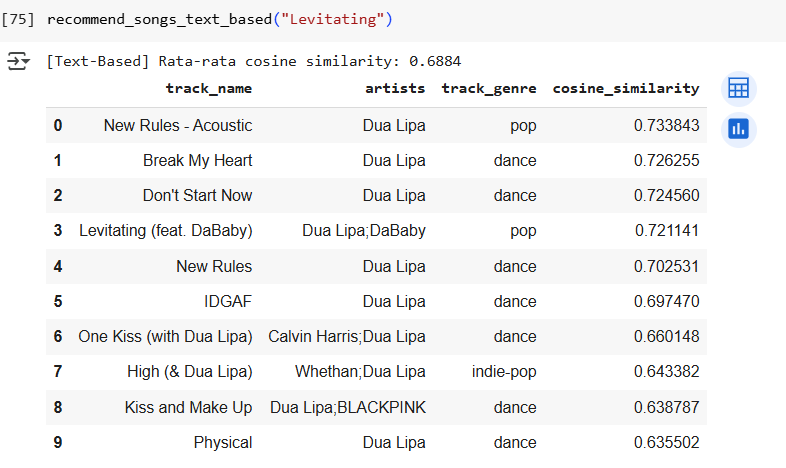
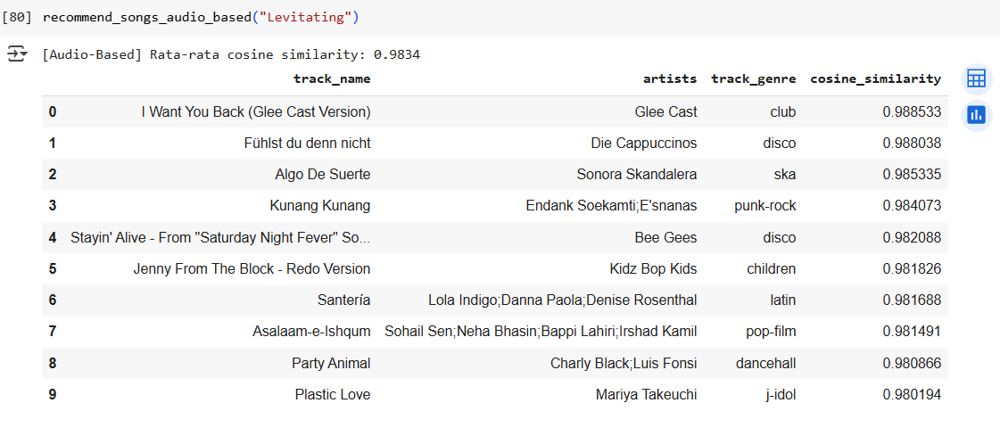
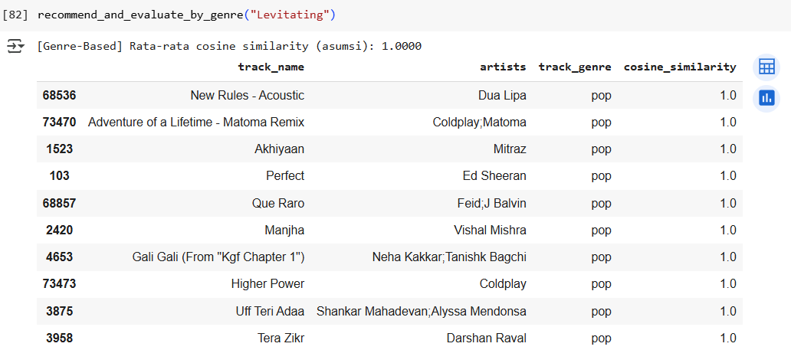
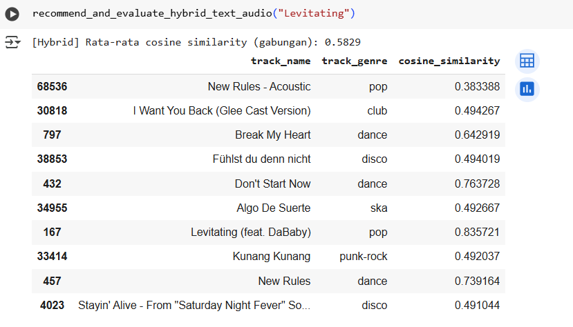
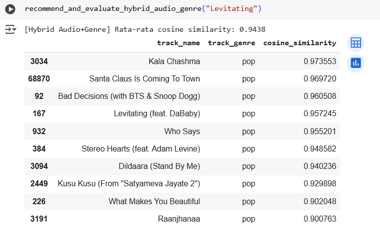

# Laporan Proyek Machine Learning - Ahmad Kholish Fauzan Shobiry

---

### Latar Belakang
Proyek ini bertujuan untuk mengembangkan sistem rekomendasi lagu berbasis konten (Content-Based Filtering) menggunakan fitur deskriptif dari lagu seperti nama lagu, artis, album, dan genre. Sistem ini akan membantu pengguna menemukan lagu yang mirip dengan preferensi mereka berdasarkan kesamaan fitur musik.

### Tujuan Proyek
Proyek ini bertujuan untuk membangun sistem rekomendasi musik berbasis content-based filtering dengan tujuan:
1. Membantu pengguna menemukan lagu-lagu baru yang mirip dengan lagu favorit mereka.
2. Memberikan pengalaman mendengarkan musik yang lebih personal dan relevan.
3. Memanfaatkan fitur audio dari lagu seperti danceability, valence, dan tempo untuk menghasilkan rekomendasi yang sesuai dengan preferensi pengguna.

### Ruang Lingkup
Proyek difokuskan pada sistem rekomendasi lagu berbasis content-based filtering dengan pendekatan sebagai berikut:
1. Dataset yang digunakan adalah Spotify Tracks Dataset dari Kaggle.
2. Sistem akan menggunakan fitur-fitur numerik seperti danceability, energy, acousticness, valence, dan tempo untuk menghitung kemiripan antar lagu.
3. Rekomendasi dihasilkan dengan menghitung kemiripan fitur menggunakan cosine similarity pada setiap model.
4. Menghitung nilai Precision@K pada kualitas sistem rekomendasi.

### Referensi
- [Dataset: Spotify Tracks Dataset – Kaggle](https://www.kaggle.com/datasets/maharshipandya/-spotify-tracks-dataset)
---

## Business Understanding
### Problem Statements
1. Bagaimana cara merekomendasikan lagu yang serupa dengan lagu favorit pengguna berdasarkan fitur-fitur kontennya?
2. Bagaimana membantu pengguna menemukan lagu baru yang sesuai dengan selera musik mereka tanpa harus mencari secara manual?

### Goals
1. Mengembangkan sistem rekomendasi lagu berbasis konten yang dapat menyarankan lagu-lagu serupa dari fitur yang tersedia seperti nama lagu, artis, genre, dan album.
2. Meningkatkan pengalaman pengguna dalam menemukan musik baru dengan pendekatan personal dan otomatis.

### Solution Statements
1. Pendekatan: Content-Based Filtering dengan menggunakan fitur-fitur deskriptif (track_name, artists, album_name, track_genre) yang diubah menjadi representasi vektor menggunakan TF-IDF, lalu dihitung kesamaannya menggunakan ANN.
2. Fitur tambahan: Potensi penggunaan fitur audio seperti danceability, energy, valence, atau tempo untuk meningkatkan kualitas rekomendasi (di tahap pengembangan lanjutan).
3. Mengukur hasil kemiripan fitur menggunakan Cosine Similarity.
    
   Cosine similarity mengukur kesamaan antara dua vektor dan menentukan apakah kedua vektor tersebut menunjuk ke arah yang sama. Ia menghitung sudut cosinus antara dua vektor. Semakin kecil sudut cosinus, semakin besar nilai cosine similarity. Metrik ini juga sering digunakan untuk mengukur kesamaan dokumen dalam analisis teks, sehingga cocok digunakan pada project dalam menilai fitur pada sistem rekomendasi.
4. Melakukan evaluasi menggunakan Precision@K untuk menilai kualitas rekomendasi berdasarkan Ground Truth.

---

## Data Understanding
Dataset yang digunakan adalah Spotify Tracks Dataset yang berisi 114.000 lagu dari 125 genre berbeda. Setiap lagu memiliki informasi deskriptif serta fitur audio yang diperoleh dari Spotify API.

### Format File
Dataset disimpan dalam format .csv dan telah dimuat ke Google Colab melalui path: /kaggle/input/-spotify-tracks-dataset/dataset.csv.

### Statistik Dataset
1. Jumlah lagu: 114.000
2. Jumlah genre: 114
3. Jumlah artis unik: ribuan
4. Distribusi genre cukup seimbang: sebagian besar genre memiliki 1.000 lagu

### Variabel dalam Dataset
Berikut merupakan variabel-variabel dalam dataset, antara lain:
1. Unnamed:0: Kolom indeks baris. (Tidak digunakan karena hanya menunjukkan nomor indeks baris saja)
2. track_id: ID unik lagu dari Spotify.
3. artists: Nama penyanyi atau grup musik; jika lebih dari satu, dipisahkan dengan tanda titik koma (;).
4. album_name: Nama album tempat lagu tersebut dimuat.
5. track_name: Judul lagunya
6. popularity: Tingkat popularitas lagu (skala 0–100); makin tinggi berarti makin sering didengarkan saat ini.
7. duration_ms: Durasi lagu dalam milidetik
8. explicit: Apakah lagu mengandung lirik eksplisit (true = ya, false = tidak/kurang jelas).
9. danceability: Seberapa cocok lagu untuk menari (0.0 = tidak cocok, 1.0 = sangat cocok).
10. energy: Ukuran intensitas dan aktivitas lagu (0.0 = tenang, 1.0 = sangat energik).
11. key: Nada dasar lagu (0 = C, 1 = C♯/D♭, dst; -1 jika tidak terdeteksi).
12. loudness: Tingkat keras suara lagu dalam desibel (dB)
13. mode: Skala lagu; 1 = mayor (ceria), 0 = minor (sedih).
14. speechiness: Seberapa banyak unsur bicara dalam lagu (0.0 = musik murni, 1.0 = penuh bicara)
15. acousticness: Keyakinan bahwa lagu bersifat akustik (0.0 = tidak akustik, 1.0 = sangat akustik).
16. instrumentalness: Perkiraan bahwa lagu tidak memiliki vokal (0.0 = banyak vokal, 1.0 = full instrumental).
17. liveness: Kemungkinan lagu direkam secara langsung di hadapan penonton (nilai > 0.8 = kemungkinan besar live).
18. valence: Tingkat nuansa emosional positif dalam lagu (0.0 = sedih, 1.0 = bahagia).
19. tempo: Kecepatan lagu dalam beat per menit (BPM).
20. time_signature: Tanda birama lagu (jumlah ketukan per bar; biasanya antara 3 sampai 7).
21. track_genre: Genre atau jenis musik lagu tersebut.

---

## Data Preparation

Tahap ini mencakup pembersihan, transformasi, dan persiapan data untuk dua jenis sistem rekomendasi: berbasis teks deskriptif dan berbasis fitur audio. Berikut adalah detail tahapan yang dilakukan:

### 1. Pemeriksaan Awal Dataset
  - Menggunakan `df.info()` dan `df.isnull().sum()` untuk melihat struktur data dan mengecek missing values.
  - Menganalisis jumlah genre unik dan distribusi 10 genre terbanyak.

### 2. Penanganan Missing Values & Kolom Tidak Penting
  - Kolom `Unnamed: 0` dihapus karena tidak relevan untuk digunakan dalam pemrosesan data.
  - Data memiliki 1 missing value pada masing-masing Kolom teks (`track_name`, `artists`, `album_name`) lalu diisi dengan string kosong (`""`) agar tidak mengganggu proses penggabungan fitur.
  - Memastikan tidak ada nilai kosong tersisa pada kolom-kolom tersebut.

### 3. Pembersihan Data
- Duplikasi berdasarkan `track_name` atau judul lagu yang sama dihapus dengan memilih lagu yang memiliki nilai `popularity` tertinggi saja.
- Baris tanpa nama lagu atau artis dihapus untuk menjaga kualitas hasil rekomendasi.

### 4. Normalisasi Tipe Data
- Kolom `popularity` dan `duration_ms` dikonversi menjadi numerik menggunakan `pd.to_numeric()` agar bisa digunakan dalam analisis lanjutan.

### 5. Penggabungan Fitur Deskriptif (Text-Based)
- Menggabungkan kolom `track_name`, `artists`, `album_name`, dan `track_genre` ke dalam kolom baru `combined_features`.
- Pemberian bobot:
  - `artists`: dikali 2
  - `track_genre`: dikali 3
- Semua teks dikonversi ke huruf kecil agar seragam untuk proses vectorization.

### 6. Vektorisasi Teks
- Menggunakan **TF-IDF Vectorizer** dengan stopwords bahasa Inggris untuk mengubah teks gabungan (`combined_features`) menjadi vektor numerik.
- Hasil: matriks TF-IDF dengan ukuran sesuai jumlah lagu dan kata unik penting.

### 7. Persiapan Fitur Audio (Audio-Based)
- Mengambil fitur audio utama: `danceability`, `energy`, `valence`, `acousticness`, `instrumentalness`, `tempo`, `speechiness`, dan `liveness`.
- Normalisasi menggunakan `StandardScaler` agar fitur memiliki skala yang seragam.

### 8. Training Model Approximate NearestNeighbors (ANN)
- Untuk **text-based recommendation**, digunakan model `NearestNeighbors` dengan metrik cosine dan algoritma brute pada matriks TF-IDF.
- Untuk **audio-based recommendation**, model yang sama diterapkan pada data numerik yang telah dinormalisasi.

> Proses ini memastikan bahwa data yang digunakan dalam sistem rekomendasi sudah bersih, terstandardisasi, dan siap untuk dianalisis lebih lanjut baik dengan pendekatan berbasis konten deskriptif maupun fitur audio.

---

## Modelling

Sesuai dengan Solution Statements yang telah ditentukan, sistem rekomendasi musik ini akan dikembangkan melalui beberapa pendekatan, antara lain:

1. **Pendekatan 1: Content-Based Filtering Berbasis Metadata Teks**
  - Sistem merekomendasikan lagu berdasarkan kemiripan konten deskriptif dari lagu yang dipilih oleh pengguna. Informasi yang digunakan meliputi:
    - track_name (judul lagu)
    - artists (nama penyanyi atau band)
    - album_name (nama album)
    - track_genre (genre musik)
  - Seluruh informasi tersebut digabung dalam satu kolom bernama combined_features, kemudian direpresentasikan sebagai vektor teks menggunakan TF-IDF (Term Frequency–Inverse Document Frequency). Kemiripan antar lagu dihitung menggunakan algoritma Approximate Nearest Neighbors (ANN) melalui NearestNeighbors dari Scikit-Learn.
  - Sistem juga melakukan penghitungan kemiripan fitur menggunakan Cosine Similarity
  - Berikut adalah hasil dari CBF berdasarkan Teks
  

2.  **Pendekatan 2: Content-Based Filtering Berbasis Fitur Audio**
  - Selain metadata, sistem juga memanfaatkan fitur numerik audio dari tiap lagu, antara lain variabel `danceability, energy, valence, tempo, acousticness, instrumentalness, speechiness, dan liveness`.
  - Fitur-fitur ini menggambarkan karakteristik teknis dari lagu dan diolah sebagai berikut:
    - Normalisasi fitur numerik menggunakan MinMaxScaler
    - Perhitungan kemiripan antar lagu menggunakan ANN
    - Penyajian lagu-lagu terdekat berdasarkan kemiripan vektor audio
  - Kelebihan:
    Pendekatan ini mampu menyarankan lagu-lagu dengan mood, energi, atau gaya musik yang mirip, bahkan jika berasal dari genre atau artis yang berbeda.
  - Sistem juga melakukan penghitungan kemiripan fitur menggunakan Cosine Similarity
  - Berikut adalah hasil dari CBF berdasarkan Audio
  

3. **Pendekatan 3: Rekomendasi Berdasarkan Genre**
  - Sistem juga menyediakan rekomendasi berbasis genre, di mana lagu-lagu dengan genre yang sama dengan lagu input akan disaring, lalu disusun berdasarkan popularitas (popularity) tertinggi.
  - Sistem juga melakukan penghitungan kemiripan fitur menggunakan Cosine Similarity
  - Berikut adalah hasil dari CBF berdasarkan Genre
  

4. **Pendekatan 4: Hybrid Filtering: Teks + Audio**
  - Sistem ini menggabungkan skor dari dua model ANN:
    - TF-IDF (representasi metadata teks)
    - ANN untuk fitur numerik audio
  - Gabungan skor menggunakan parameter alpha untuk mengatur bobot kontribusi masing-masing model.
  - Contoh: alpha = 0.5 memberi kontribusi seimbang antara teks dan audio.
  - Menghasilkan rekomendasi yang lebih seimbang dari sisi semantik dan musikalitas.
  - Sistem juga melakukan penghitungan kemiripan fitur menggunakan Cosine Similarity
  - Berikut adalah hasil dari CBF berdasarkan Teks + Audio (Hybrid)
  

5. **Pendekatan 5: Hybrid Filtering: Audio + Genre**
  - Pendekatan ini menggabungkan:
    - Kemiripan fitur audio (melalui ANN)
    - Filter berdasarkan genre yang sama
  - Setelah menemukan lagu-lagu mirip secara audio, sistem menyaring hanya lagu-lagu dengan genre yang sesuai.
  - Kelebihan: Menghasilkan rekomendasi lagu yang memiliki mood serupa sekaligus mempertahankan genre musik yang disukai.
  - Sistem juga melakukan penghitungan kemiripan fitur menggunakan Cosine Similarity
  - Berikut adalah hasil dari CBF berdasarkan Genre + Audio (Hybrid)
  

### Tujuan Modelling
Melalui lima pendekatan ini, sistem rekomendasi ini bertujuan untuk:
1. Menyediakan rekomendasi lagu yang personal dan kontekstual
2. Memberikan fleksibilitas pendekatan sesuai preferensi pengguna
3. Menggabungkan kekuatan teks deskriptif dan fitur akustik dalam satu sistem
4. Membantu pengguna menemukan lagu-lagu baru yang relevan berdasarkan kesamaan gaya, suasana, dan genre.

---

## Evaluation
Evaluasi ini bertujuan untuk mengukur kualitas rekomendasi lagu berdasarkan dua metrik utama: **Cosine Similarity** untuk kemiripan fitur dan **Precision@K** untuk kualitas rekomendasi.

### Hasil Evaluasi pada lagu berjudul "Levitating"

| Metode                       | Cosine Similarity | Precision@K |
|-----------------------------|-------------------|-------------|
| **Text-Based**               | 0.6884            | 0.3         |
| **Audio-Based**              | 0.9834            | 0.0         |
| **Genre-Based**              | 1.0000            | 0.0         |
| **Hybrid Text + Audio**      | 0.5829            | 0.2         |
| **Hybrid Audio + Genre**     | 0.9438            | 0.0         |

### Interpretasi Hasil

- Model **Audio-Based** dan **Genre-Based** memiliki nilai kemiripan tertinggi, menandakan bahwa lagu-lagu yang direkomendasikan sangat mirip secara fitur.
- Namun, **kemiripan tinggi tidak selalu berarti relevansi tinggi** secara kontekstual.
- Model **Hybrid Text + Audio** memiliki kemiripan paling rendah, namun bisa saja menangkap konteks yang lebih bervariasi.
- Model **Text-Based** menunjukkan performa terbaik dalam hal relevansi lagu yang direkomendasikan.
- Model **Audio-Based** dan **Genre-Based** gagal menghasilkan rekomendasi yang relevan menurut ground truth, meskipun secara fitur sangat mirip.
- Model **Hybrid Text + Audio** menghasilkan performa moderat, menunjukkan bahwa penggabungan fitur dapat memberikan manfaat, namun perlu optimasi lebih lanjut.

### Kesimpulan
- **Cosine similarity tinggi** tidak selalu berbanding lurus dengan **relevansi** rekomendasi.
- Model berbasis **teks** lebih andal dalam menghasilkan rekomendasi yang relevan meskipun fitur kemiripannya lebih rendah.

### Kesimpulan Project
Dari eksplorasi yang telah dilakukan, ***Problem Statements*** di atas akhrinya terjawab berdasarkan uraian berikut:
1. Cara merekomendasikan lagu yang serupa dengan lagu favorit pengguna dilakukan dengan pendekatan Content-Based Filtering, yang memanfaatkan fitur-fitur deskriptif lagu (seperti nama lagu, artis, genre, album) dan fitur audio (seperti danceability, valence, tempo). Fitur-fitur ini diubah menjadi representasi vektor menggunakan TF-IDF, kemudian dihitung tingkat kesamaannya menggunakan Approximate Nearest Neighbors (ANN) dan Cosine Similarity. Selanjutnya dilakukan penghitungan Precision@K untuk mengukur kualitas berdasarkan Ground Truth.
2. Untuk membantu pengguna menemukan lagu baru tanpa pencarian manual, sistem secara otomatis memberikan rekomendasi lagu yang mirip berdasarkan lagu favorit pengguna. Proses ini bersifat personal dan relevan karena mempertimbangkan karakteristik musik yang disukai pengguna, sehingga mereka tidak perlu melakukan pencarian eksplisit.